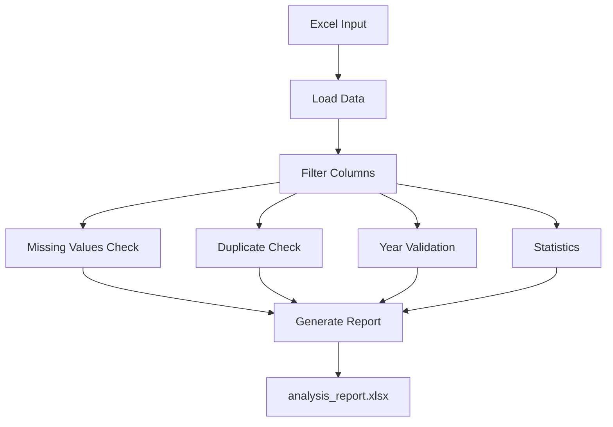

# Data Quality Analysis Script

## Overview
This script performs comprehensive data quality analysis on the NDC (Nationally Determined Contributions) Database, specifically analyzing climate target information from the "Targets" sheet of the Excel workbook.

## Purpose
The script validates and analyzes climate targets data to identify:
- Missing or incomplete data fields
- Year validation issues (target years not found in content)
- Data completeness and quality metrics
- Statistical summaries of key categorical variables

## Analysis Workflow

```
┌─────────────────────────────────────────────────────────────┐
│                      INPUT DATA                              │
│  NDC-Database-Analysis_current_NEW.xlsx                     │
│  Sheet: "Targets" (Starting at Row 8)                       │
└────────────────────┬────────────────────────────────────────┘
                     │
                     ▼
┌─────────────────────────────────────────────────────────────┐
│              STEP 1: DATA LOADING                            │
│  • Read Excel file (Targets sheet, header=7)                │
│  • Filter to 9 target columns                                │
│  • Create DataFrame                                          │
└────────────────────┬────────────────────────────────────────┘
                     │
                     ▼
┌─────────────────────────────────────────────────────────────┐
│         STEP 2: BASIC OVERVIEW ANALYSIS                      │
│  • Count rows & columns                                      │
│  • Identify data types                                       │
│  • Display column names                                      │
└────────────────────┬────────────────────────────────────────┘
                     │
                     ▼
┌─────────────────────────────────────────────────────────────┐
│         STEP 3: MISSING VALUES DETECTION                     │
│  • Scan all columns for NULL/NaN values                     │
│  • Calculate missing count & percentage                      │
│  • Flag incomplete entries with ❌                           │
└────────────────────┬────────────────────────────────────────┘
                     │
                     ▼
┌─────────────────────────────────────────────────────────────┐
│         STEP 4: STATISTICAL ANALYSIS                         │
│  • Generate descriptive statistics                           │
│  • Count unique values                                       │
│  • Identify most frequent values                             │
└────────────────────┬────────────────────────────────────────┘
                     │
                     ▼
┌─────────────────────────────────────────────────────────────┐
│         STEP 5: DUPLICATE DETECTION                          │
│  • Identify duplicate rows                                   │
│  • Count total duplicates                                    │
└────────────────────┬────────────────────────────────────────┘
                     │
                     ▼
┌─────────────────────────────────────────────────────────────┐
│         STEP 6: CATEGORICAL VALUE COUNTS                     │
│  • Target area distribution                                  │
│  • Target scope distribution                                 │
│  • Target type distribution                                  │
│  • Conditionality distribution                               │
└────────────────────┬────────────────────────────────────────┘
                     │
                     ▼
┌─────────────────────────────────────────────────────────────┐
│         STEP 7: YEAR VALIDATION (Critical Check)             │
│                                                              │
│  ┌──────────────────────────────────────────────┐           │
│  │ Extract years from "Target Year" column      │           │
│  └──────────────┬───────────────────────────────┘           │
│                 │                                            │
│                 ▼                                            │
│  ┌──────────────────────────────────────────────┐           │
│  │ Search for years in "Content" column         │           │
│  └──────────────┬───────────────────────────────┘           │
│                 │                                            │
│         ┌───────┴────────┐                                  │
│         │                │                                  │
│         ▼                ▼                                  │
│    ┌─────────┐      ┌──────────┐                           │
│    │ FOUND   │      │ NOT FOUND│                           │
│    │    ✓    │      │    ❌    │                           │
│    └─────────┘      └────┬─────┘                           │
│                          │                                  │
│                          ▼                                  │
│              ┌───────────────────────┐                      │
│              │ Extract alternative   │                      │
│              │ years from content    │                      │
│              │ (2015 onwards only)   │                      │
│              └───────────────────────┘                      │
└─────────────────────┬───────────────────────────────────────┘
                      │
                      ▼
┌─────────────────────────────────────────────────────────────┐
│              OUTPUT GENERATION                               │
│                                                              │
│  📊 analysis_report.xlsx                                    │
│  ├── Sheet 1: Data with Flags                               │
│  ├── Sheet 2: Data (Clean)                                  │
│  ├── Sheet 3: Statistics                                    │
│  ├── Sheet 4: Missing Values Summary                        │
│  ├── Sheet 5: Year Not In Content ⚠️                       │
│  ├── Sheet 6: Incomplete Rows                               │
│  └── Sheets 7-10: Categorical Value Counts                  │
│                                                              │
│  📄 Console Report                                          │
│  └── Summary statistics & validation results                │
└─────────────────────────────────────────────────────────────┘
```

## Data Flow Diagram

```
┌──────────────┐
│ Excel Input  │
│  9 Columns   │
└──────┬───────┘
       │
       ▼
┌──────────────────────────────────────┐
│     Quality Checks (Parallel)        │
├──────────────────────────────────────┤
│                                      │
│  ┌─────────────┐  ┌──────────────┐  │
│  │   Missing   │  │ Duplicates   │  │
│  │   Values    │  │   Check      │  │
│  └──────┬──────┘  └──────┬───────┘  │
│         │                │          │
│  ┌──────▼────────────────▼───────┐  │
│  │    Year Validation            │  │
│  │  • Extract years              │  │
│  │  • Match with content         │  │
│  │  • Suggest alternatives       │  │
│  └──────┬────────────────────────┘  │
│         │                           │
│  ┌──────▼────────┐                 │
│  │  Statistics   │                 │
│  │  & Counts     │                 │
│  └───────────────┘                 │
└──────────────┬───────────────────────┘
               │
               ▼
        ┌─────────────┐
        │  Multi-sheet│
        │    Excel    │
        │   Report    │
        └─────────────┘
```



## Quality Check Decision Tree

```
                    ┌─────────────────┐
                    │  Data Row       │
                    └────────┬────────┘
                             │
                    ┌────────▼─────────┐
                    │ Has Missing      │
                    │ Values?          │
                    └────┬─────────┬───┘
                         │         │
                    YES  │         │  NO
                         │         │
                    ┌────▼───┐     │
                    │ Flag & │     │
                    │ Report │     │
                    └────────┘     │
                                   │
                         ┌─────────▼──────────┐
                         │ Target Year exists?│
                         └─────┬──────────┬───┘
                               │          │
                          YES  │          │  NO
                               │          │
                    ┌──────────▼───┐      │
                    │ Year in      │      │
                    │ Content?     │      │
                    └──┬────────┬──┘      │
                       │        │         │
                  YES  │        │  NO     │
                       │        │         │
                  ┌────▼──┐ ┌───▼──────┐ │
                  │  ✓    │ │ ❌ Flag  │ │
                  │ PASS  │ │ Suggest  │ │
                  │       │ │ Alt Year │ │
                  └───────┘ └──────────┘ │
                                         │
                                    ┌────▼────┐
                                    │ N/A     │
                                    │ Cannot  │
                                    │ Validate│
                                    └─────────┘
```

## Requirements
```bash
pip install pandas openpyxl
```