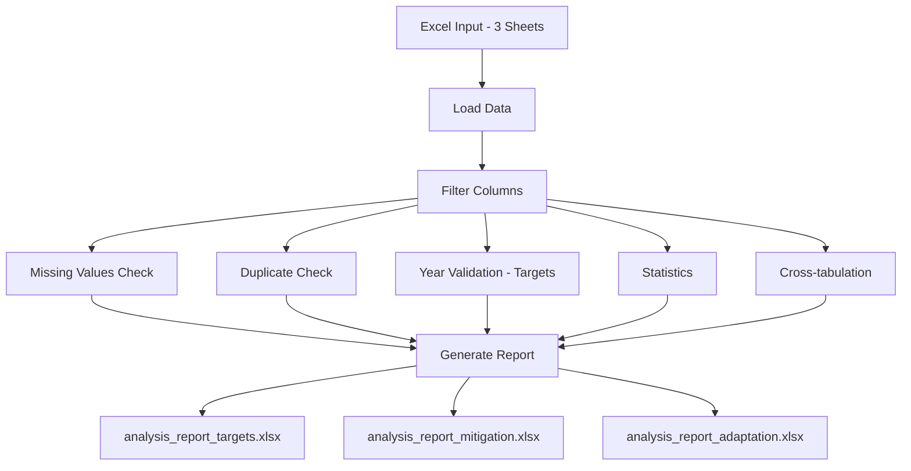

# Data Quality Analysis Scripts

## Overview
This suite of scripts performs comprehensive data quality analysis on the NDC (Nationally Determined Contributions) Database, analyzing three main data categories:
- **Targets**: Climate target information and commitments
- **Mitigation**: Mitigation measures and actions
- **Adaptation**: Adaptation measures and activities

## Purpose
The scripts validate and analyze NDC data to identify:
- Missing or incomplete data fields
- Duplicate entries
- Year validation issues (targets only - target years not found in content)
- Data completeness and quality metrics
- Statistical summaries of key categorical variables
- Cross-tabulation analysis of related fields

## Scripts

### 1. `dq_targets.py`
Analyzes climate targets from the "Targets" sheet.

**Analyzed Columns:**
- Document ID
- Country Code
- Version number
- Target area
- Target scope
- GHG target?
- Target type
- Conditionality
- Target Year
- Content
- Page Number

**Special Feature:** Year validation - checks if Target Year appears in Content field and suggests alternatives.

### 2. `dq_mitigation.py`
Analyzes mitigation measures from the "Mitigation" sheet.

**Analyzed Columns:**
- Document ID
- Country Code
- Version number
- Category
- Purpose
- Instrument
- Quote
- A-S-I (Avoid-Shift-Improve)
- Activity type
- Status of measure
- Page Number

### 3. `dq_adaptation.py`
Analyzes adaptation measures from the "Adaptation" sheet.

**Analyzed Columns:**
- Document ID
- Country Code
- Version number
- Category
- Measure
- Quote
- Page Number
- Activity type

## Analysis Workflow

```
┌─────────────────────────────────────────────────────────────┐
│                      INPUT DATA                              │
│  NDC-Database-Analysis_current_NEW.xlsx                     │
│  Sheets: "Targets" | "Mitigation" | "Adaptation"            │
│  (Data Starting at Row 8, Header at Row 7)                  │
└────────────────────┬────────────────────────────────────────┘
                     │
                     ▼
┌─────────────────────────────────────────────────────────────┐
│              STEP 1: DATA LOADING                            │
│  • Read Excel file (specified sheet, header=7)              │
│  • Filter to relevant columns                                │
│  • Create DataFrame                                          │
└────────────────────┬────────────────────────────────────────┘
                     │
                     ▼
┌─────────────────────────────────────────────────────────────┐
│         STEP 2: BASIC OVERVIEW ANALYSIS                      │
│  • Count rows & columns                                      │
│  • Identify data types                                       │
│  • Display column names                                      │
└────────────────────┬────────────────────────────────────────┘
                     │
                     ▼
┌─────────────────────────────────────────────────────────────┐
│         STEP 3: MISSING VALUES DETECTION                     │
│  • Scan all columns for NULL/NaN values                     │
│  • Calculate missing count & percentage                      │
│  • Flag incomplete entries with ❌ MISSING                   │
└────────────────────┬────────────────────────────────────────┘
                     │
                     ▼
┌─────────────────────────────────────────────────────────────┐
│         STEP 4: STATISTICAL ANALYSIS                         │
│  • Generate descriptive statistics                           │
│  • Count unique values                                       │
│  • Identify most frequent values                             │
└────────────────────┬────────────────────────────────────────┘
                     │
                     ▼
┌─────────────────────────────────────────────────────────────┐
│         STEP 5: DUPLICATE DETECTION                          │
│  • Identify duplicate rows (all columns match)               │
│  • Assign Duplicate_Group IDs (starting from 1)             │
│  • Group duplicates together for review                      │
│  • Count total duplicates                                    │
└────────────────────┬────────────────────────────────────────┘
                     │
                     ▼
┌─────────────────────────────────────────────────────────────┐
│         STEP 6: CATEGORICAL VALUE COUNTS                     │
│  • Distribution analysis for key categorical fields          │
│  • Country Code, Version number, Categories, etc.            │
│  • Shows top 10 values for fields with many unique values   │
└────────────────────┬────────────────────────────────────────┘
                     │
                     ▼
┌─────────────────────────────────────────────────────────────┐
│         STEP 7: YEAR VALIDATION (Targets Only)               │
│                                                              │
│  ┌──────────────────────────────────────────────┐           │
│  │ Extract years from "Target Year" column      │           │
│  └──────────────┬───────────────────────────────┘           │
│                 │                                            │
│                 ▼                                            │
│  ┌──────────────────────────────────────────────┐           │
│  │ Search for years in "Content" column         │           │
│  └──────────────┬───────────────────────────────┘           │
│                 │                                            │
│         ┌───────┴────────┐                                  │
│         │                │                                  │
│         ▼                ▼                                  │
│    ┌─────────┐      ┌──────────┐                           │
│    │ FOUND   │      │ NOT FOUND│                           │
│    │    ✓    │      │    ❌    │                           │
│    └─────────┘      └────┬─────┘                           │
│                          │                                  │
│                          ▼                                  │
│              ┌───────────────────────┐                      │
│              │ Extract alternative   │                      │
│              │ years from content    │                      │
│              │ (2015 onwards only)   │                      │
│              └───────────────────────┘                      │
└─────────────────────┬───────────────────────────────────────┘
                      │
                      ▼
┌─────────────────────────────────────────────────────────────┐
│              OUTPUT GENERATION                               │
│                                                              │
│  📊 analysis_report_[targets|mitigation|adaptation].xlsx    │
│  ├── Sheet 1: Data with Flags                               │
│  ├── Sheet 2: Data (Clean)                                  │
│  ├── Sheet 3: Statistics                                    │
│  ├── Sheet 4: Missing Values Summary                        │
│  ├── Sheet 5: Duplicate Rows (if any found) 🔄             │
│  ├── Sheet 6: Year Not In Content (Targets only) ⚠️        │
│  ├── Sheet 7: Incomplete Rows                               │
│  └── Sheets 8+: Categorical Value Counts & Cross-tabs       │
│                                                              │
│  📄 Console Report                                          │
│  └── Summary statistics & validation results                │
└─────────────────────────────────────────────────────────────┘
```

## Data Flow Diagram

```
┌──────────────┐
│ Excel Input  │
│  Multiple    │
│  Sheets      │
└──────┬───────┘
       │
       ▼
┌──────────────────────────────────────┐
│     Quality Checks (Parallel)        │
├──────────────────────────────────────┤
│                                      │
│  ┌─────────────┐  ┌──────────────┐  │
│  │   Missing   │  │ Duplicates   │  │
│  │   Values    │  │   Check      │  │
│  └──────┬──────┘  └──────┬───────┘  │
│         │                │          │
│  ┌──────▼────────────────▼───────┐  │
│  │    Year Validation            │  │
│  │  (Targets only)               │  │
│  │  • Extract years              │  │
│  │  • Match with content         │  │
│  │  • Suggest alternatives       │  │
│  └──────┬────────────────────────┘  │
│         │                           │
│  ┌──────▼────────┐                 │
│  │  Statistics   │                 │
│  │  & Counts     │                 │
│  └───────────────┘                 │
└──────────────┬───────────────────────┘
               │
               ▼
        ┌─────────────┐
        │  Multi-sheet│
        │    Excel    │
        │   Reports   │
        └─────────────┘
```



## Quality Check Decision Tree

```
                    ┌─────────────────┐
                    │  Data Row       │
                    └────────┬────────┘
                             │
                    ┌────────▼─────────┐
                    │ Has Missing      │
                    │ Values?          │
                    └────┬─────────┬───┘
                         │         │
                    YES  │         │  NO
                         │         │
                    ┌────▼───┐     │
                    │ Flag & │     │
                    │ Report │     │
                    └────────┘     │
                                   │
                         ┌─────────▼──────────┐
                         │ Is Duplicate?      │
                         └─────┬──────────┬───┘
                               │          │
                          YES  │          │  NO
                               │          │
                    ┌──────────▼───┐      │
                    │ Assign Group │      │
                    │ ID & Flag    │      │
                    └──────────────┘      │
                                          │
                         ┌────────────────▼──────┐
                         │ Target Year exists?   │
                         │ (Targets sheet only)  │
                         └─────┬──────────┬──────┘
                               │          │
                          YES  │          │  NO
                               │          │
                    ┌──────────▼───┐      │
                    │ Year in      │      │
                    │ Content?     │      │
                    └──┬────────┬──┘      │
                       │        │         │
                  YES  │        │  NO     │
                       │        │         │
                  ┌────▼──┐ ┌───▼──────┐ │
                  │  ✓    │ │ ❌ Flag  │ │
                  │ PASS  │ │ Suggest  │ │
                  │       │ │ Alt Year │ │
                  └───────┘ └──────────┘ │
                                         │
                                    ┌────▼────┐
                                    │ PASS    │
                                    │ (No year│
                                    │  check) │
                                    └─────────┘
```

## Requirements
```bash
pip install pandas openpyxl
```

## Output Reports

Each script generates a separate Excel report with multiple sheets:

### Common Sheets (All Reports)

#### Sheet 1: Data with Flags
- Complete dataset with validation flags
- Column structure: `[Original Column] [Column_MISSING] ...`
- Missing values marked with "❌ MISSING"
- **Targets only:** Additional `Year_In_Content` and `Suggested_Years` columns

#### Sheet 2: Data
- Original data without flags (clean view)

#### Sheet 3: Statistics
- Descriptive statistics for all columns
- Count, unique, top, freq, mean, std, min, max, percentiles

#### Sheet 4: Missing Values
- Summary table showing:
  - Column name
  - Missing count
  - Missing percentage

#### Sheet 5: Duplicate Rows
**New Feature - All Reports**
- Shows only rows that have duplicates
- `Duplicate_Group` column identifies which rows are copies of each other
- Groups numbered starting from 1
- Duplicates sorted together for easy review
- Only created if duplicates exist

#### Sheet 6: Year Not In Content (Targets Only)
**Key Quality Issue Report**
- Shows only rows where Target Year is NOT found in Content
- Displays: Original columns + **Suggested_Years** + Year_In_Content
- No _MISSING flag columns (clean view for review)
- Column order: Document ID → ... → Target Year → **Suggested_Years** → Year_In_Content → ...

#### Sheet 7 (or 6): Incomplete Rows
- Shows all rows with at least one missing value
- Includes _MISSING flag columns for each field

### Additional Categorical Analysis Sheets

**Targets:**
- Version number
- Target area
- Target scope
- Target type
- Conditionality

**Mitigation:**
- Country Code
- Version number
- Category
- Purpose
- Instrument
- A-S-I
- Activity type
- Status of measure
- Category-Purpose (cross-tab)
- Instrument by Category (cross-tab)
- A-S-I by Activity (cross-tab)
- Status by Country (cross-tab)

**Adaptation:**
- Country Code
- Version number
- Category
- Measure
- Activity type
- Category-Measure (cross-tab)
- Activity by Category (cross-tab)
- Measure by Country (cross-tab)
- Category by Country (cross-tab)

## Usage

### Basic Usage

**Run individual scripts:**
```bash
# Analyze Targets
python dq_targets.py

# Analyze Mitigation
python dq_mitigation.py

# Analyze Adaptation
python dq_adaptation.py
```

**Run all analyses:**
```bash
python dq_targets.py && python dq_mitigation.py && python dq_adaptation.py
```

### Customize File Paths
Edit each script's `__main__` section:
```python
if __name__ == "__main__":
    input_file = "path/to/your/excel/file.xlsx"
    output_file = "path/to/output/report.xlsx"
    
    data = analyze_excel(input_file)
    export_analysis_report(data, output_file)
```

## Console Output
Each script prints analysis results to console:
```
Analysis of: [filename]
==================================================

1. Dataset Overview:
   - Rows: XXX
   - Columns: X
   - Column names: [...]

2. Data Types:
   [...]

3. Missing Values:
   [columns with missing data]

4. Descriptive Statistics:
   [...]

5. Duplicate Rows:
   - Number of duplicates: XX

6. Value Counts for Key Columns:
   [distributions for categorical fields]

7. Target Year Validation: (Targets only)
   - Rows where Target Year is NOT in Content: XX
   - Percentage: XX.XX%
   - Rows with suggested alternative years: XX
```

## Key Quality Metrics

### Completeness Score
Calculate from "Missing Values" sheet:
```
Completeness = (Total cells - Missing cells) / Total cells × 100%
```

### Duplicate Rate
From "Duplicate Rows" sheet:
```
Duplicate Rate = (Duplicate rows / Total rows) × 100%
```

### Year Accuracy (Targets Only)
From "Year Not In Content" sheet:
```
Year Accuracy = (Total rows - Rows with year mismatch) / Total rows × 100%
```

## Interpretation Guide

### Red Flags 🚩
- **High percentage (>10%) of missing values** in critical columns
- **Target Year not found in Content** → possible data entry error (Targets only)
- **Many duplicate entries** → possible data collection issues
- **Many suggested alternative years** → verify if Target Year is correct

### Action Items

**Priority 1: Duplicates**
1. Review "Duplicate Rows" sheet
2. Determine if duplicates are legitimate or errors
3. Identify root cause (copy-paste errors, merge issues, etc.)
4. Remove or flag for verification

**Priority 2: Year Validation (Targets)**
1. Review "Year Not In Content" sheet
2. Check "Suggested_Years" against source documents
3. Update Target Year field if alternative year is correct
4. Document any intentional mismatches

**Priority 3: Missing Values**
1. Check "Incomplete Rows" for missing required fields
2. Prioritize by completeness percentage
3. Attempt to fill from source documents
4. Flag unfillable entries

## File Structure
```
dq/
├── dq_targets.py              # Targets analysis script
├── dq_mitigation.py           # Mitigation analysis script
├── dq_adaptation.py           # Adaptation analysis script
├── README.md                  # This file
├── excel/
│   └── NDC-Database-Analysis_current_NEW.xlsx  # Input data
├── analysis_report_targets.xlsx        # Generated output
├── analysis_report_mitigation.xlsx     # Generated output
└── analysis_report_adaptation.xlsx     # Generated output
```

## Technical Details

### Data Loading
- All scripts read from row 8 (header at row 7) of their respective sheets
- Column filtering ensures only relevant fields are analyzed
- Handles missing columns gracefully

### Duplicate Detection Algorithm
1. Uses `df.duplicated(keep=False)` to find all rows with duplicates
2. Groups identical rows using `groupby()` on all columns
3. Assigns sequential group IDs starting from 1 using `ngroup() + 1`
4. Handles NaN values correctly with `dropna=False`

### Year Validation Logic (Targets Only)
- Extracts 4-digit years matching pattern `20XX` from Target Year field
- Searches for these years in Content text
- Only suggests years from 2015 onwards (future-focused climate targets)
- Suggests multiple years if found (comma-separated list)

## Notes
- All scripts assume data starts at row 8 (row 7 is header)
- Year validation only in Targets script (2015+ years only)
- Empty cells in Target Year or Content columns skip year validation (marked N/A)
- Duplicate detection considers all columns - even one different cell means not a duplicate
- Cross-tabulation sheets show relationships between categorical variables

## Support
For issues or questions about the analysis:
- Review console output for detailed error messages
- Check that column names match expected format
- Verify Excel file has correct sheet names: "Targets", "Mitigation", "Adaptation"
- Ensure data starts at row 8 with headers at row 7

## Future Enhancements
Potential improvements:
- Combined summary report across all three sheets
- Interactive dashboard with visualizations
- Automated correction suggestions
- Integration with version control for tracking changes
- Email notifications for critical quality issues